# Noctra Installation Flow Analysis

## Scope and conclusion

This repository is an **Arch post-install distribution layer**, not a standalone image builder.

It currently provides this combination:

| Capability | Present? | Evidence / notes |
| --- | --- | --- |
| Installer script | Yes | `install.sh` is the main installer after the source tree is present at `~/.local/share/omarchy`. |
| Bootstrap script | Yes | `boot.sh` prepares online installation, configures the Omarchy-compatible package mirror, clones the repository, checks out a branch, and sources `install.sh`. |
| Post-install customization system | Yes | First-run scripts, refresh commands, theme commands, hooks, migrations, branding files, and user config copies customize the installed Arch system. |
| Complete installable distro image | No | No archiso profile, image build script, ISO makefile, or rootfs/image pipeline is present in this repository. The package lists mention use by an ISO builder, but that builder is not included here. |

The user-facing installation model is therefore:

1. Start from a manually installed, fresh, vanilla Arch Linux system that satisfies the guard checks.
2. Run the online bootstrap (`boot.sh`) via a fetched script, or clone/place this repository at `~/.local/share/omarchy` and run `install.sh` directly.
3. Let the installer install packages, copy configuration, configure login/boot visuals, enable services, and reboot.
4. On the first Hyprland session startup, `omarchy-first-run` completes tasks that require a graphical/user session.

## Exact installation entry points

### Online bootstrap path

`boot.sh` is designed for curl-style online installations. It:

1. Sets `OMARCHY_ONLINE_INSTALL=true`.
2. Prints Noctra ASCII branding.
3. Selects `OMARCHY_REF` (`master` by default; `dev` and `rc` select different mirrors).
4. Writes an Omarchy-compatible mirror URL to `/etc/pacman.d/mirrorlist`.
5. Installs `git` with `sudo pacman -Syu --noconfirm --needed git`.
6. Clones `OMARCHY_REPO` into `~/.local/share/omarchy`.
7. Checks out `OMARCHY_REF`.
8. Sources `~/.local/share/omarchy/install.sh`.

Noctra Hyprland Edition is derived from Omarchy, but `boot.sh` now bootstraps from `tattedbeardo89/omarchy` by default. The inherited `OMARCHY_REPO` variable remains supported for compatibility and can still override the clone source when needed.

Example override shape:

```bash
OMARCHY_REPO='<owner>/<repo>' bash <(curl -fsSL '<published boot.sh URL>')
```

### Local/manual installer path

`install.sh` assumes the repository already exists at `~/.local/share/omarchy`. It exports:

- `OMARCHY_PATH="$HOME/.local/share/omarchy"`
- `OMARCHY_INSTALL="$OMARCHY_PATH/install"`
- `OMARCHY_INSTALL_LOG_FILE="/var/log/omarchy-install.log"`
- `PATH="$OMARCHY_PATH/bin:$PATH"`

Then it sources the installer stage aggregators in this order:

1. `install/helpers/all.sh`
2. `install/preflight/all.sh`
3. `install/packaging/all.sh`
4. `install/config/all.sh`
5. `install/login/all.sh`
6. `install/post-install/all.sh`

A manual local install therefore requires something equivalent to:

```bash
git clone '<noctra repository URL>' ~/.local/share/omarchy
cd ~/.local/share/omarchy
bash install.sh
```

## Installation flow diagram

```mermaid
flowchart TD
  A[Fresh vanilla Arch user session] --> B{Entry point}
  B -->|Online| C[boot.sh]
  B -->|Local clone| D[install.sh]
  C --> C1[Set OMARCHY_ONLINE_INSTALL=true]
  C1 --> C2[Select OMARCHY_REF and mirror]
  C2 --> C3[pacman -Syu git]
  C3 --> C4[Clone OMARCHY_REPO to ~/.local/share/omarchy]
  C4 --> C5[git checkout OMARCHY_REF]
  C5 --> D

  D --> E[helpers/all.sh]
  E --> E1[chroot, presentation, errors, logging helpers]
  E1 --> F[preflight/all.sh]
  F --> F1[guard.sh: Arch, non-root, x86_64, no Secure Boot, fresh, Limine, Btrfs]
  F1 --> F2[begin.sh: Noctra logo, install log]
  F2 --> F3[show-env.sh]
  F3 --> F4[pacman.sh: online repo/keyring/full refresh]
  F4 --> F5[migrations.sh: mark bundled migrations applied]
  F5 --> F6[first-run-mode.sh: marker and temporary sudoers]
  F6 --> F7[disable-mkinitcpio.sh]

  F7 --> G[packaging/all.sh]
  G --> G1[base.sh: omarchy-base.packages]
  G1 --> G2[fonts, nvim, icons, webapps, TUIs, npm CLIs]
  G2 --> G3[hardware packages: ASUS ROG, Framework 16, Dell XPS haptics, Surface]

  G3 --> H[config/all.sh]
  H --> H1[config.sh: copy config to ~/.config and bashrc]
  H1 --> H2[theme.sh: Tokyo Night and Noctra wallpaper]
  H2 --> H3[branding.sh: Fastfetch and screensaver branding]
  H3 --> H4[system/user configuration and hardware fixes]

  H4 --> I[login/all.sh]
  I --> I1[plymouth.sh -> omarchy-refresh-plymouth]
  I1 --> I2[default-keyring.sh]
  I2 --> I3[sddm.sh -> omarchy-refresh-sddm, session, autologin, service]
  I3 --> I4[hibernation.sh]
  I4 --> I5[limine-snapper.sh: Limine, UKI, snapshots]

  I5 --> J[post-install/all.sh]
  J --> J1[pacman.sh: final pacman/mirror config]
  J1 --> J2[allow-reboot.sh]
  J2 --> J3[finished.sh: Noctra logo, reboot prompt]
  J3 --> K[Reboot]
  K --> L[Limine bootloader]
  L --> M[Plymouth]
  M --> N[SDDM]
  N --> O[Noctra Hyprland Edition session]
  O --> P[Hyprland autostart]
  P --> Q[omarchy-first-run]
  Q --> R[First-run scripts, welcome, Wi-Fi]
```



## Key scripts and execution order

### Bootstrap and installer root

| Order | Script | Purpose |
| ---: | --- | --- |
| 0 | `boot.sh` | Optional online bootstrap; clones the repo and starts `install.sh`. |
| 1 | `install.sh` | Main installer; exports paths/logging variables and invokes all stages. |

### Helpers

| Order | Script | Purpose |
| ---: | --- | --- |
| 1.1 | `install/helpers/chroot.sh` | Provides `chrootable_systemctl_enable` so services can be enabled without `--now` in chroot installs. |
| 1.2 | `install/helpers/presentation.sh` | Ensures `gum`, computes terminal/logo dimensions, and provides `clear_logo`. |
| 1.3 | `install/helpers/errors.sh` | Installs traps, restores output, displays failure UI, and offers retry/log/upload options. |
| 1.4 | `install/helpers/logging.sh` | Creates `/var/log/omarchy-install.log`, streams log tail, and runs stage scripts with `run_logged`. |

### Preflight

| Order | Script | Purpose |
| ---: | --- | --- |
| 2.1 | `install/preflight/guard.sh` | Validates manual prerequisites. |
| 2.2 | `install/preflight/begin.sh` | Clears the screen, shows the Noctra logo, and starts logging. |
| 2.3 | `install/preflight/show-env.sh` | Logs relevant environment variables. |
| 2.4 | `install/preflight/pacman.sh` | For online installs, installs build tools, configures pacman, imports key, installs keyring, and refreshes packages. |
| 2.5 | `install/preflight/migrations.sh` | Marks bundled migrations as already applied for new installs. |
| 2.6 | `install/preflight/first-run-mode.sh` | Creates `~/.local/state/omarchy/first-run.mode` and temporary sudoers entries for first run. |
| 2.7 | `install/preflight/disable-mkinitcpio.sh` | Temporarily disables mkinitcpio pacman hooks to avoid repeated initramfs rebuilds during package install. |

### Package installation

| Order | Script | Purpose |
| ---: | --- | --- |
| 3.1 | `install/packaging/base.sh` | Installs every package from `install/omarchy-base.packages` through `omarchy-pkg-add`. |
| 3.2 | `install/packaging/fonts.sh` | Installs the Noctra/Omarchy glyph font to `~/.local/share/fonts` and refreshes font cache. |
| 3.3 | `install/packaging/nvim.sh` | Runs `omarchy-nvim-setup`. |
| 3.4 | `install/packaging/icons.sh` | Copies bundled application icons. |
| 3.5 | `install/packaging/webapps.sh` | Creates webapp launchers. |
| 3.6 | `install/packaging/tuis.sh` | Creates TUI launchers for Disk Usage and Docker. |
| 3.7 | `install/packaging/npm.sh` | Installs npm-based developer/AI CLIs. |
| 3.8 | `install/packaging/asus-rog.sh` | Installs ASUS ROG support when detected. |
| 3.9 | `install/packaging/framework16.sh` | Installs Framework 16 QMK HID support when detected. |
| 3.10 | `install/packaging/dell-xps-touchpad-haptics.sh` | Installs Dell XPS haptics support when detected. |
| 3.11 | `install/packaging/surface.sh` | Installs Surface firmware support when detected. |

### Configuration

| Order | Script | Purpose |
| ---: | --- | --- |
| 4.1 | `install/config/config.sh` | Copies default configs into `~/.config` and writes Noctra `.bashrc`. |
| 4.2 | `install/config/theme.sh` | Applies Tokyo Night, then applies `assets/noctra/wallpapers/wallpaper.png` if present. |
| 4.3 | `install/config/branding.sh` | Copies `icon.txt` and `logo.txt` to user-editable branding paths. |
| 4.4+ | Remaining `install/config/*.sh` | Configures git/gpg/timezones/sudo/system limits/keyboard/mimetypes/user dirs/toggles/local DB/Waybar menu helpers/fast shutdown/hardware. |
| 4.H | `install/config/hardware/**/*.sh` | Applies network, Bluetooth, printer, GPU, Vulkan, Intel, ASUS, Framework, Apple, Lenovo, Broadcom, Surface, and other hardware fixes. |

### Login, boot, and snapshots

| Order | Script | Purpose |
| ---: | --- | --- |
| 5.1 | `install/login/plymouth.sh` | Calls `omarchy-refresh-plymouth`. |
| 5.2 | `install/login/default-keyring.sh` | Configures the default keyring. |
| 5.3 | `install/login/sddm.sh` | Calls `omarchy-refresh-sddm`, installs the session file, configures SDDM Wayland/autologin, edits PAM keyring lines, and enables SDDM. |
| 5.4 | `install/login/hibernation.sh` | Configures hibernation when supported. |
| 5.5 | `install/login/limine-snapper.sh` | Configures mkinitcpio hooks, Limine defaults, boot menu styling, UKI, Snapper, and Limine boot entries. |

### Post-install and first login

| Order | Script | Purpose |
| ---: | --- | --- |
| 6.1 | `install/post-install/pacman.sh` | Rewrites pacman config/mirrorlist and appends Apple T2 Mac repo when detected. |
| 6.2 | `install/post-install/allow-reboot.sh` | Adds temporary passwordless reboot permission. |
| 6.3 | `install/post-install/finished.sh` | Stops logging, displays Noctra logo/time, removes old installer sudoers, and prompts to reboot. |
| 7.1 | `default/hypr/autostart.lua` | Starts background services and executes `omarchy-first-run` at session startup. |
| 7.2 | `bin/omarchy-first-run` | Removes first-run marker, runs first-run scripts, removes temporary sudoers, shows welcome, and runs Wi-Fi setup. |

## Dependencies

### Manual prerequisites enforced by guards

- Vanilla Arch Linux (`/etc/arch-release` must exist, and known derivative release marker files must not exist).
- Non-root user execution.
- x86_64 CPU.
- Secure Boot disabled.
- Fresh system without explicitly installed GNOME Shell or Plasma Desktop.
- Limine bootloader available on `PATH`.
- Btrfs root filesystem.

### Bootstrap dependencies

- Network access to pacman mirrors, GitHub, and package repositories.
- `sudo` access for pacman, mirror/keyring writes, service setup, bootloader changes, and config writes.
- `git` installable from pacman.
- Correct `OMARCHY_REPO` and `OMARCHY_REF` values for a Noctra install.

### Package/runtime dependencies installed by the repository

- Hyprland stack: `hyprland`, `uwsm`, `xdg-desktop-portal-hyprland`, `hypridle`, `hyprlock`, `hyprpicker`, `hyprsunset`, `swaybg`, `waybar`, `mako`, `swayosd`.
- Login/boot stack: `sddm`, `plymouth`, `limine`, `limine-mkinitcpio-hook`, `limine-snapper-sync`, `snapper`.
- Base desktop apps and utilities from `install/omarchy-base.packages`.
- Optional hardware packages from hardware detection scripts.
- npm-based CLIs installed by `install/packaging/npm.sh`.

## Hyprland setup trace

1. `install/packaging/base.sh` installs `hyprland`, `uwsm`, `hypridle`, `hyprlock`, `hyprsunset`, Hyprland portal packages, Waybar, Mako, SwayOSD, and supporting tools.
2. `install/config/config.sh` copies repository `config/hypr/*` into `~/.config/hypr`.
3. `install/config/theme.sh` runs `omarchy-theme-set "Tokyo Night"`, which generates themed configs and restarts components when present.
4. `default/wayland-sessions/omarchy.desktop` defines the SDDM session as `Name=Noctra Hyprland Edition` and launches Hyprland through UWSM.
5. At session startup, `default/hypr/autostart.lua` launches `hypridle`, `mako`, `waybar`, `fcitx5`, `swaybg`, the polkit agent, monitor watch, and `omarchy-first-run`.

## SDDM setup trace

1. `install/login/sddm.sh` calls `omarchy-refresh-sddm`.
2. `omarchy-refresh-sddm` copies `default/sddm/omarchy` into `/usr/share/sddm/themes/omarchy`.
3. If `assets/noctra/logos/noctra-logo.png` exists, it overwrites the SDDM theme `logo.png`; if not, it falls back to `assets/noctra/logos/logo.png`.
4. If `assets/noctra/sddm/sddm-background.png` exists, it overwrites the SDDM theme `background.png`.
5. `install/login/sddm.sh` installs `default/wayland-sessions/omarchy.desktop` to `/usr/local/share/wayland-sessions/omarchy.desktop`.
6. It installs the SDDM Hyprland compositor config to `/usr/share/sddm/hyprland.lua`.
7. It writes `/etc/sddm.conf.d/10-wayland.conf` for a Wayland SDDM greeter.
8. It writes or updates `/etc/sddm.conf.d/autologin.conf` with `Session=omarchy` and `[Theme] Current=omarchy`.
9. It removes PAM gnome-keyring password/auth lines for SDDM and enables `sddm.service`.

## Plymouth setup trace

1. `install/login/plymouth.sh` calls `omarchy-refresh-plymouth`.
2. `omarchy-refresh-plymouth` copies `default/plymouth/*` into `/usr/share/plymouth/themes/omarchy`.
3. If `assets/noctra/plymouth/plymouth-logo.png` exists, it overwrites `logo.png` and `logos/oma.png` in the Plymouth theme.
4. If the Plymouth-specific logo is missing but `assets/noctra/logos/noctra-logo.png` exists, that shared logo is used instead.
5. The default Plymouth theme is set to `omarchy`.
6. The initramfs/UKI is rebuilt with `limine-mkinitcpio` when available, otherwise `mkinitcpio -P`.

## Theme setup trace

1. `install/config/theme.sh` creates `~/.config/omarchy/themes`.
2. It prepares Chromium managed-policy directories.
3. It calls `omarchy-theme-set "Tokyo Night"`.
4. `omarchy-theme-set` normalizes the theme name to `tokyo-night`, builds `~/.config/omarchy/current/next-theme`, overlays user customizations, generates templated configs, swaps it into `~/.config/omarchy/current/theme`, writes `theme.name`, and updates app-specific themes.
5. It then calls `omarchy-theme-bg-set` with the Noctra default wallpaper when `assets/noctra/wallpapers/wallpaper.png` exists.

## Wallpaper and lockscreen trace

- Desktop wallpaper: `install/config/theme.sh` sets `~/.config/omarchy/current/background` to `assets/noctra/wallpapers/wallpaper.png` when that file exists. `default/hypr/autostart.lua` starts `swaybg -i ~/.config/omarchy/current/background -m fill`.
- Lockscreen wallpaper: `config/hypr/hyprlock.conf` sets the lockscreen background path to `~/.local/share/omarchy/assets/noctra/wallpapers/lockscreen.png`.

## Noctra asset application trace

| Asset | Applied by | Destination / effect |
| --- | --- | --- |
| `logo.txt` | `boot.sh`, `presentation.sh`, `finished.sh`, `branding.sh` | Installer banner, install UI, finish UI, screensaver branding source. |
| `icon.txt` | `install/config/branding.sh` | `~/.config/omarchy/branding/about.txt` for Fastfetch/about branding. |
| `assets/noctra/wallpapers/wallpaper.png` | `install/config/theme.sh` | `~/.config/omarchy/current/background` symlink, shown by SwayBG. |
| `assets/noctra/wallpapers/lockscreen.png` | `config/hypr/hyprlock.conf` | Hyprlock background. |
| `assets/noctra/plymouth/plymouth-logo.png` | `omarchy-refresh-plymouth` | Plymouth theme logo and `logos/oma.png`. |
| `assets/noctra/logos/noctra-logo.png` | `omarchy-refresh-sddm`; Plymouth fallback | SDDM logo; Plymouth fallback logo. |
| `assets/noctra/sddm/sddm-background.png` | `omarchy-refresh-sddm` | SDDM background image. |
| `default/limine/limine.conf` | `install/login/limine-snapper.sh` | Limine bootloader branding text and Tokyo Night color palette. |
| `config/fastfetch/config.jsonc` | `install/config/config.sh` | Fastfetch logo and OS text render Noctra branding. |

## Potential failure points

### Entry/bootstrap

- `boot.sh` defaults to `OMARCHY_REPO=tattedbeardo89/omarchy`, so online bootstrap installs the canonical Noctra fork by default while preserving the inherited override variable.
- Network failures can affect pacman, GitHub clone/fetch, keyserver access, package refreshes, npm installs, and support-log upload.
- `OMARCHY_REF` must exist in the selected repository.
- The configured package mirrors are still Omarchy-compatible URLs, not Noctra-owned mirrors.

### Preflight

- Guard checks can stop or warn on non-Arch systems, Arch derivatives, root execution, non-x86_64 machines, Secure Boot, existing GNOME/KDE, missing Limine, or non-Btrfs root.
- The guard uses an interactive `gum confirm` to proceed after unmet requirements; non-interactive runs may fail there.
- `gum` is installed during helper presentation if missing; if package installation is unavailable before pacman setup, presentation can fail.

### Package installation

- `omarchy-pkg-add` exits if pacman fails or if any package is still not registered after pacman returns.
- Package availability depends on the configured Arch and Omarchy-compatible repositories.
- npm CLI installation can fail due to npm registry/network issues.
- Hardware detection scripts can install packages unavailable for the current channel.

### Configuration

- Recursive copy to `~/.config` overwrites/collides with existing user config on non-fresh systems.
- Theme setup expects the `Tokyo Night` theme directory and theme templating commands to work.
- The Noctra wallpaper step is conditional; if `assets/noctra/wallpapers/wallpaper.png` is missing, the theme background fallback is used instead.
- Branding setup assumes `icon.txt` and `logo.txt` exist in the repo root.

### Login/boot

- Plymouth refresh requires `/usr/share/plymouth/themes/omarchy` to be writable/creatable and `plymouth-set-default-theme` to succeed.
- Initramfs rebuild can fail through `limine-mkinitcpio` or `mkinitcpio -P`.
- SDDM setup assumes SDDM paths and PAM files exist.
- SDDM autologin writes `Session=omarchy`, so the installed session file name must remain `omarchy.desktop`.
- Limine setup fails if it cannot find an existing Limine config path.
- Limine setup depends on Snapper/Btrfs and can fail if boot entries are not generated into `/boot/limine.conf`.

### First boot / first login

- Autologin depends on SDDM and the `omarchy` session being available.
- `omarchy-first-run` depends on temporary sudoers entries created during preflight; if they are missing, first-run service setup can fail.
- First-run welcome and Wi-Fi scripts can introduce interactive prompts after the graphical session starts.

## Branding validation summary

Expected Noctra-branded surfaces:

- Installer bootstrap banner: Noctra ASCII art.
- Installer progress and finish screen: `logo.txt` Noctra text art.
- Bootloader: `interface_branding: Noctra Bootloader`.
- Plymouth: Noctra logo image copied over the inherited `omarchy` Plymouth theme path.
- SDDM: Noctra logo/background copied over the inherited `omarchy` SDDM theme path.
- Session chooser: `Noctra Hyprland Edition`.
- Desktop wallpaper: Noctra wallpaper symlinked as current background.
- Lockscreen: Noctra lockscreen wallpaper path.
- Fastfetch: Noctra icon text and `Noctra Hyprland Edition $version`.
- Waybar menu tooltip: `Noctra Menu`.

Remaining user-visible Omarchy references found in the installation path are tracked separately in `NOCTRA_REMAINING_BRANDING_ITEMS.md`.
